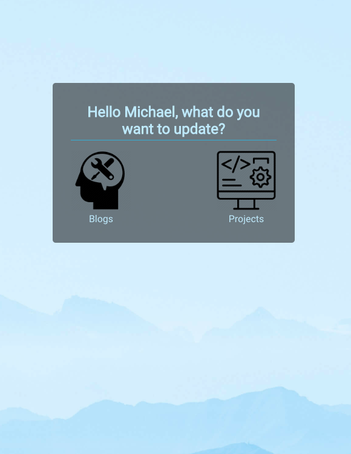
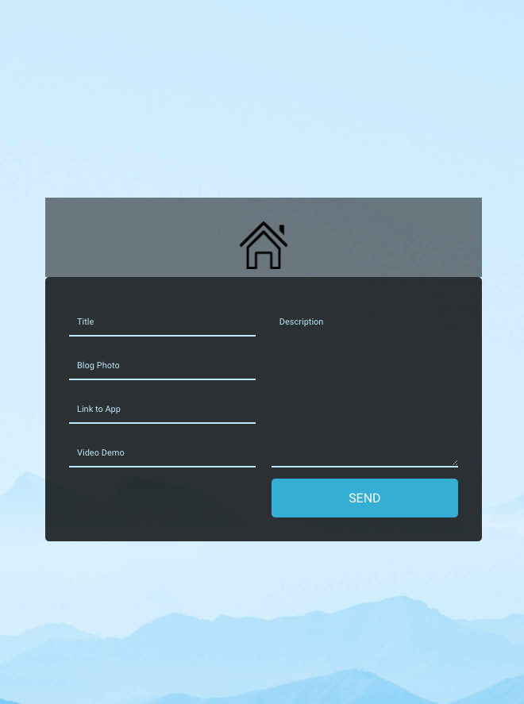
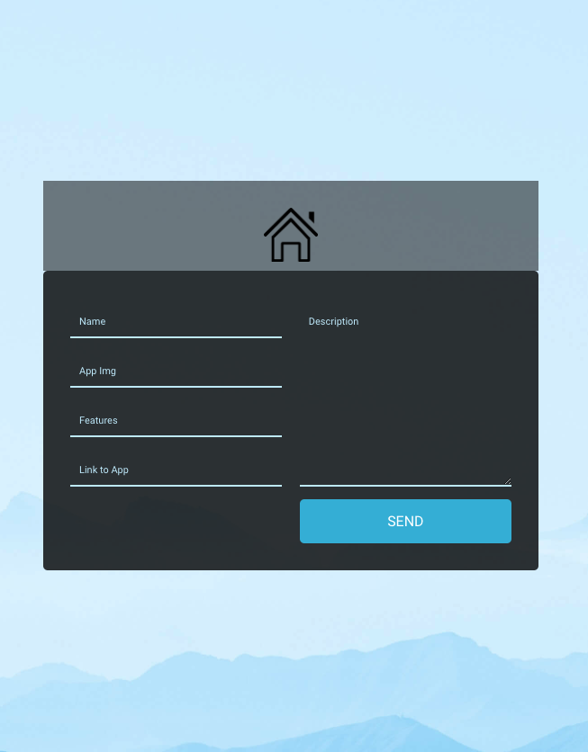
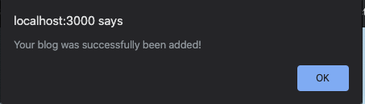

# Portfolio Manager

## Problem

> Updating my portfolio always requires me to go into my code and actually update it. 
> To save time, I have created this manager as a helper to manage my updates to my 
> portolio since I will be updating blog every few days.
> This manager updates my portfolio database with blogs and projects which my portfolio client can fetch.

#### Technology Used

> React, JavaScript, CSS, NPM
> [Check out my Portfolio](https://michaelanokyej.github.io/portfolio-manager/ "Link to Portfolio Manager screen").

## Home Screen

> Portfolio Manager welcomes you with a home screen where you get to choose what to update.
> 

## Add Blog Form

> You can update the database with a new blog by submitting this form.
> 

## Add Project Form

> You can update the database with a new project by submitting this form.
> 

## Success Alert

> You are alerted with the results when an update is attempted.
> 

## Video Demo

> Below is a video demo of how portfolio manager works.
> 
